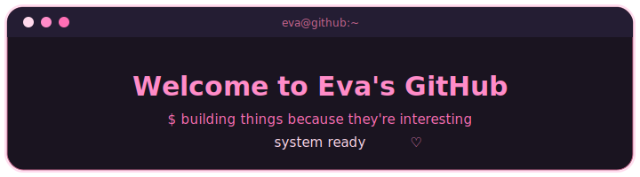
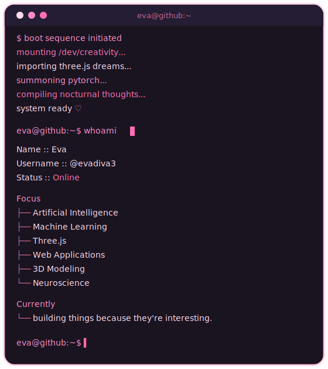

<div align="center">




</div>

---

<div align="center">

</div>

---

<div align="center">

</div>

<p align="center">

</p>

<p align="center">

</p>

---

<div align="center">

</div>

```bash
eva@github:~$ tree

.
├── ai/
├── machine-learning/
├── threejs/
├── blender/
├── experiments/
└── ideas/

6 directories
```

---

<div align="center">

</div>

<div align="center">





</div>

> Stats and top-langs cards are generated by a workflow (not a live third-party call) since the public `github-readme-stats.vercel.app` instance is frequently rate-limited/down. Add the workflow below as `.github/workflows/stats.yml`.

```yaml
name: update readme stats cards

on:
  schedule:
    - cron: "0 0 * * *"
  workflow_dispatch:
  push:
    branches:
      - main

jobs:
  build:
    runs-on: ubuntu-latest
    permissions:
      contents: write
    steps:
      - uses: actions/checkout@v4

      - name: Generate stats card
        uses: stats-organization/github-readme-stats-action@v2
        with:
          card: stats
          options: username=evadiva3&show_icons=true&include_all_commits=true&hide_border=true&bg_color=1a1420&title_color=FF8CC8&icon_color=FF6FB5&text_color=FFD9EC
          path: assets/stats.svg
          token: ${{ secrets.GITHUB_TOKEN }}

      - name: Generate top languages card
        uses: stats-organization/github-readme-stats-action@v2
        with:
          card: top-langs
          options: username=evadiva3&layout=compact&langs_count=8&hide_border=true&bg_color=1a1420&title_color=FF8CC8&text_color=FFD9EC
          path: assets/top-langs.svg
          token: ${{ secrets.GITHUB_TOKEN }}

      - name: Commit updated cards
        run: |
          git config user.name "github-actions[bot]"
          git config user.email "github-actions[bot]@users.noreply.github.com"
          git add assets/stats.svg assets/top-langs.svg
          git commit -m "chore: refresh stats cards" || exit 0
          git push
```

<div align="center">

---

<div align="center">

</div>

<p align="center">

</p>


---

<div align="center">

```bash
eva@github:~$ echo "Thanks for stopping by ♡"

Thanks for stopping by ♡
```


</div>
